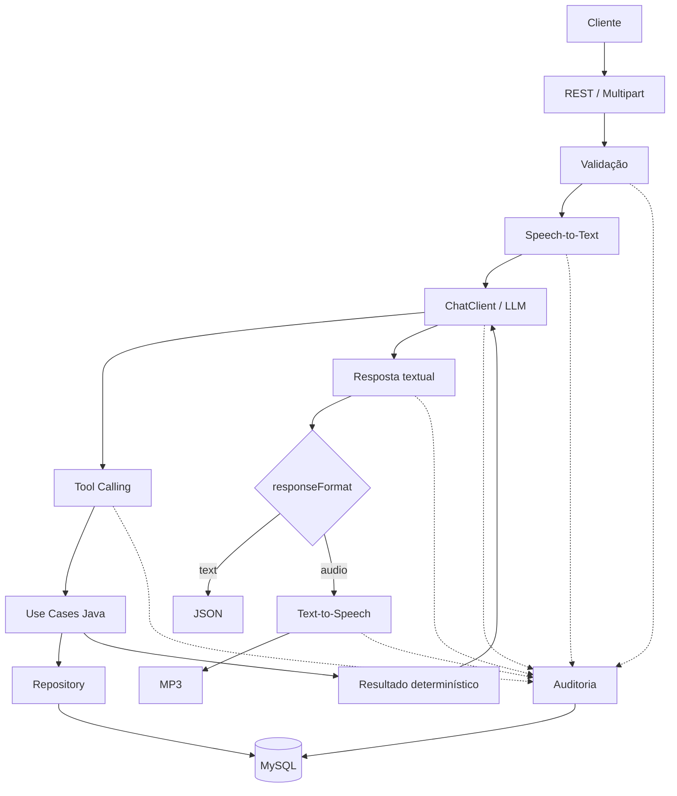

# Smart Budget API — Spring Boot + Spring AI

[](https://github.com/gcipolla1402/smart-budget-spring-ai/actions/workflows/ci.yml)


API financeira inteligente desenvolvida como evolução do desafio final do **Bootcamp Itaú — Java com Inteligência Artificial**, da [Digital Innovation One (DIO)](https://www.dio.me/).

A aplicação recebe comandos de voz, transcreve o áudio, interpreta a intenção com um LLM e usa Tool Calling para executar regras reais da aplicação. As despesas são persistidas e consultadas no MySQL, enquanto a resposta pode ser devolvida em JSON ou, opcionalmente, sintetizada em áudio MP3.

> Projeto-base: [digitalinnovationone/dio-spring-boot-learning-track — 05-spring-ai](https://github.com/digitalinnovationone/dio-spring-boot-learning-track/tree/main/05-spring-ai)

## Demonstração validada

O fluxo real foi validado de ponta a ponta: `áudio → Speech-to-Text → LLM → Tool Calling → Use Case → MySQL → resposta textual/TTS`.

A validação também confirmou a idempotência em uma repetição real da operação, reutilizando a transação já persistida e evitando duplicidade.

## Principais diferenciais

- API REST com Spring Boot e persistência MySQL.
- Integração com Spring AI por meio de `ChatClient`.
- Tool Calling conectado a use cases Java.
- Speech-to-Text para comandos enviados em áudio.
- resposta textual como padrão e Text-to-Speech opcional.
- cálculos financeiros determinísticos executados em Java.
- idempotência persistente e protegida contra concorrência.
- auditoria das interações de IA e das Tools.
- schema versionado com Flyway e validado pelo Hibernate.
- documentação interativa com Swagger/OpenAPI.
- ambientes Docker Compose separados para desenvolvimento e testes.
- CI com GitHub Actions sem chamadas reais à OpenAI.
- 142 testes locais automatizados.

## Arquitetura

O projeto preserva a separação entre domínio, aplicação e infraestrutura.

| Camada | Pacotes principais | Responsabilidade |
|---|---|---|
| **Domain** | `dio.budgeting.domain` | Entidades, identificadores, categorias e contrato do repositório. Não depende de Spring AI nem de JPA. |
| **Application** | `dio.budgeting.application` | Use cases, validações, cálculos financeiros, inputs e outputs. |
| **Infrastructure** | `dio.budgeting.infrastructure` | Controllers REST, DTOs, Spring AI, Tools, auditoria, JPA, configurações, Swagger e integrações externas. |

As regras financeiras ficam nos use cases. As Tools adaptam os argumentos escolhidos pelo modelo e delegam a execução para essa camada. O LLM interpreta linguagem natural, mas não soma valores, calcula diferenças ou percentuais e não implementa regras de persistência.

Valores monetários são armazenados como `long` em centavos. Datas usam `LocalDate`, e expressões relativas recebem como referência um `Clock` configurado para `America/Sao_Paulo`.

## Decisões de engenharia

- As regras e os cálculos financeiros são determinísticos e executados em Java.
- O LLM interpreta a intenção do usuário e escolhe as Tools, que delegam a execução aos use cases.
- A idempotência persistente evita transações duplicadas em retries.
- A auditoria registra metadados técnicos sem persistir conteúdo financeiro sensível.
- Os testes que acessam a OpenAI ficam separados da suíte normal.
- O CI executa testes e build sem consumir créditos da OpenAI.

## Diagrama



## Fluxo de uma requisição de IA

1. O cliente envia um arquivo no campo multipart `file` para `POST /transactions/ai`.
2. O upload é validado quanto à presença, conteúdo, tamanho, extensão e tipo de mídia.
3. O `TranscriptionModel` converte o áudio em texto.
4. O `ChatClient` envia a transcrição ao modelo com a data atual e as Tools disponíveis.
5. O modelo identifica a intenção e solicita a Tool adequada.
6. A Tool converte os argumentos recebidos e chama o use case correspondente.
7. O use case valida a entrada, executa os cálculos e consulta ou persiste dados pelo repositório.
8. A auditoria registra etapas, Tools, duração, resultado técnico e falhas classificadas.
9. O modelo produz uma única resposta textual a partir do resultado da Tool.
10. Com `responseFormat=text`, a resposta retorna em JSON sem TTS. Com `responseFormat=audio`, o mesmo texto é enviado uma vez ao serviço de Text-to-Speech e retorna como MP3.

## Funcionalidades

- criação de despesas por REST e por comando de voz;
- listagem de despesas por categoria;
- total por categoria e período inclusivo;
- resumo financeiro por período;
- distribuição de gastos por categoria;
- resumo mensal;
- comparação entre dois períodos;
- listagem por intervalo inclusivo;
- identificação da categoria com maior gasto;
- identificação da maior transação;
- apresentação de categorias sem movimentação nas consultas próprias para isso;
- resposta textual estruturada;
- resposta opcional em áudio MP3;
- idempotência no cadastro de transações;
- validação de uploads antes de qualquer chamada ao provedor;
- funcionamento dos endpoints REST comuns sem OpenAI.

O domínio atual representa somente **despesas**. Receitas, saldo e resultado entre receitas e despesas não fazem parte do modelo.

## Tools disponíveis

| Tool | Responsabilidade |
|---|---|
| `persist-transaction` | Valida e persiste uma despesa, reutilizando a proteção de idempotência quando uma chave foi enviada. |
| `list-transactions-by-category` | Lista despesas de uma categoria. |
| `calculate-category-total` | Calcula o total e a quantidade de despesas de uma categoria em um período inclusivo. |
| `generate-financial-summary` | Gera total, quantidade, distribuição por categoria, maior categoria e maior transação de um período. |
| `get-expenses-by-category` | Retorna todas as categorias, inclusive sem movimentação, ordenadas do maior para o menor gasto. |
| `get-monthly-summary` | Resolve os limites do mês em Java e gera o resumo mensal. |
| `compare-periods` | Compara dois períodos e calcula totais, diferença, percentual e resultado em Java. |
| `list-expenses-by-period` | Lista despesas entre duas datas inclusivas, ordenadas por data. |

Exemplos de perguntas suportadas:

- “Quanto eu gastei este mês?”
- “Quanto gastei com mercado em setembro?”
- “Qual categoria teve mais gastos?”
- “Compare meus gastos de agosto com setembro.”
- “Mostre um resumo financeiro deste mês.”
- “Liste meus gastos entre 1 e 15 de setembro.”

## Idempotência

Os endpoints de criação aceitam o header opcional:

```http
Idempotency-Key: 550e8400-e29b-41d4-a716-446655440000
```

Na primeira execução, a operação é processada normalmente e o resultado fica associado à chave. Uma repetição com a mesma chave e o mesmo conteúdo devolve a transação original, inclusive o mesmo UUID, sem nova persistência.

A reutilização da chave com conteúdo diferente retorna **HTTP 409 Conflict**. Para essa comparação, a aplicação deriva um fingerprint SHA-256 dos dados relevantes da operação, sem guardar uma cópia adicional do payload.

A chave possui unicidade no MySQL. O repositório combina transação de banco, bloqueio para leitura concorrente e constraint única, permitindo que requisições simultâneas com a mesma chave converjam para uma única transação persistida. Sem o header, cada chamada válida mantém o comportamento tradicional de criação.

## Auditoria e observabilidade

Cada chamada de `POST /transactions/ai` recebe um identificador no header:

```http
X-AI-Execution-Id: 550e8400-e29b-41d4-a716-446655440000
```

A auditoria persiste:

- identificador e timestamps da execução;
- duração;
- formato solicitado, `text` ou `audio`;
- status `STARTED`, `SUCCEEDED` ou `FAILED`;
- etapa atual e etapa da falha;
- Tools executadas e seus resultados técnicos;
- UUID da transação, quando disponível;
- uso ou não de idempotência;
- tamanho e hash SHA-256 da transcrição e da resposta;
- código de erro classificado.

As etapas possíveis são `UPLOAD_VALIDATION`, `TRANSCRIPTION`, `CHAT`, `TOOL`, `PERSISTENCE`, `RESPONSE` e `TTS`. Uma execução textual bem-sucedida termina em `RESPONSE`; uma execução em áudio bem-sucedida termina em `TTS`.

A auditoria não persiste o áudio original, a transcrição completa, o prompt, a resposta completa, a API key, stack traces, mensagens internas do provedor nem valores financeiros das chamadas. Falhas ao gravar observabilidade são registradas em log e não transformam, por si só, uma operação de negócio bem-sucedida em erro.

## Tecnologias

| Tecnologia | Versão ou configuração |
|---|---|
| Java | 25 |
| Spring Boot | 4.0.5 |
| Spring AI | 2.0.0-M4 |
| Gradle Wrapper | 9.4.1 |
| MySQL | 9.6 via Docker |
| Spring Data JPA / Hibernate | gerenciado pelo Spring Boot |
| Flyway | 11.14.1, gerenciado pelo Spring Boot |
| Springdoc OpenAPI | 3.0.3 |
| Docker Compose | desenvolvimento e testes isolados |
| JUnit Jupiter, AssertJ, Mockito e MockMvc | via Spring Boot Test |
| Lombok | plugin 9.2.0 |
| GitHub Actions | CI em push e pull request |
| OpenAI | chat, transcrição e síntese de voz |

## Modelos OpenAI

| Recurso | Configuração |
|---|---|
| Chat | `gpt-4o-mini` |
| Speech-to-Text | `whisper-1` |
| Text-to-Speech | `gpt-4o-mini-tts` |
| Voz | `nova` |
| Formato de voz | MP3 |

## Como executar

### Requisitos

- Java 25;
- Docker Desktop ou Docker Engine com Compose;
- Git;
- `OPENAI_API_KEY` apenas para o endpoint de IA.

A aplicação usa:

- porta HTTP `8080`;
- MySQL de desenvolvimento na porta `3307`;
- banco `transaction`;
- credenciais locais fictícias `app/app`.

### Configurar OpenAI

Nunca coloque uma chave em arquivos versionados. Use apenas um placeholder ao documentar a configuração:

```text
OPENAI_API_KEY=sua_chave_aqui
```

No PowerShell:

```powershell
$env:OPENAI_API_KEY="sua_chave_aqui"
```

No Linux ou macOS:

```bash
export OPENAI_API_KEY="sua_chave_aqui"
```

### Iniciar a aplicação

Windows:

```powershell
.\gradlew.bat bootRun
```

Linux ou macOS:

```bash
./gradlew bootRun
```

O Spring Boot inicia o MySQL definido em `compose.yml`, o Flyway aplica as migrations pendentes e o Hibernate valida o schema.

## Execução sem OpenAI

A aplicação inicia normalmente sem `OPENAI_API_KEY`. Nesse modo continuam disponíveis:

- `POST /transactions`;
- `GET /transactions/{category}`;
- `GET /transactions/{category}/total`;
- `GET /transactions/summary`;
- Swagger UI e especificação OpenAPI.

Uma chamada a `POST /transactions/ai` responde **HTTP 503 Service Unavailable** com uma mensagem controlada. Isso permite desenvolver, testar persistência e usar os endpoints REST sem consumo da API externa.

## Exemplos de uso

Os exemplos usam dados fictícios.

### Criar uma despesa via REST

```bash
curl -X POST "http://localhost:8080/transactions" \
  -H "Content-Type: application/json" \
  -H "Idempotency-Key: exemplo-compra-2026-09-30" \
  -d '{
    "description": "Compras do mês",
    "category": "GROCERIES",
    "amount": 12550,
    "occurredOn": "2026-09-30"
  }'
```

O campo `amount` é recebido em centavos; `12550` representa `125.50` na resposta.

### Consultar despesas

```bash
curl "http://localhost:8080/transactions/GROCERIES"

curl "http://localhost:8080/transactions/GROCERIES/total?start=2026-09-01&end=2026-09-30"

curl "http://localhost:8080/transactions/summary?start=2026-09-01&end=2026-09-30"
```

As datas inicial e final são inclusivas. As categorias existentes são `GROCERIES`, `PHARMA` e `AUTO`.

### IA com resposta textual

```bash
curl -X POST "http://localhost:8080/transactions/ai?responseFormat=text" \
  -H "Idempotency-Key: exemplo-audio-texto-2026-09-30" \
  -F "file=@src/test/resources/audio/recording-1.m4a"
```

A resposta é `application/json` e contém, quando disponível, a transcrição, a resposta do modelo, `responseFormat` e `transactionId`. Esse formato não executa TTS.

### IA com resposta em áudio

```bash
curl -X POST "http://localhost:8080/transactions/ai?responseFormat=audio" \
  -H "Idempotency-Key: exemplo-audio-voz-2026-09-30" \
  -F "file=@src/test/resources/audio/recording-1.m4a" \
  --output resposta.mp3
```

A resposta é `audio/mpeg`. O texto produzido pelo modelo é enviado uma vez ao TTS, e o identificador da execução permanece disponível em `X-AI-Execution-Id`.

O upload aceita `flac`, `mp3`, `mp4`, `mpeg`, `mpga`, `m4a`, `ogg`, `wav` e `webm`, respeitando o limite configurável padrão de 25 MB.

## Swagger / OpenAPI

Com a aplicação em execução:

- Swagger UI: [http://localhost:8080/swagger-ui/index.html](http://localhost:8080/swagger-ui/index.html)
- OpenAPI JSON: [http://localhost:8080/v3/api-docs](http://localhost:8080/v3/api-docs)

A interface documenta os cinco endpoints existentes, headers, parâmetros, exemplos, erros e as respostas JSON ou MP3 do fluxo de IA.

## Banco de dados e Flyway

O schema é administrado pelo Flyway. A migration inicial está em:

```text
src/main/resources/db/migration/V1__create_current_schema.sql
```

Ela contempla:

- `transaction_entity`;
- `transaction_idempotency`;
- `ai_interaction_audit`;
- `ai_tool_execution_audit`;
- PKs, FKs, unicidade de idempotência, índices e constraints.

O Hibernate usa:

```properties
spring.jpa.hibernate.ddl-auto=validate
```

Em um banco novo, o Flyway cria o schema antes da inicialização do JPA. O banco de testes também recebe as migrations automaticamente. Alterações futuras devem criar uma nova migration versionada; uma migration já aplicada não deve ser editada.

O ambiente de desenvolvimento usa `compose.yml` e volume persistente. Os testes usam `compose-test.yml`, credenciais próprias, porta aleatória e `tmpfs`, sem acessar dados de desenvolvimento.

## Testes

### Suíte local

Windows:

```powershell
.\gradlew.bat test
```

Linux ou macOS:

```bash
./gradlew test
```

### Build completo

Windows:

```powershell
.\gradlew.bat build
```

Linux ou macOS:

```bash
./gradlew build
```

### Integrações reais OpenAI

Windows:

```powershell
.\gradlew.bat openAiIntegrationTest
```

Linux ou macOS:

```bash
./gradlew openAiIntegrationTest
```

`test` e `build` executam somente testes locais, fakes/mocks e integrações com o MySQL isolado. Eles não executam chamadas à OpenAI, mesmo que uma chave esteja configurada no ambiente.

`openAiIntegrationTest` é uma tarefa separada e explícita. Ela realiza chamadas reais e pode consumir créditos.

Baseline local validado:

| Classes | Testes | Aprovados | Falhas | Pulados |
|---:|---:|---:|---:|---:|
| 26 | 142 | 142 | 0 | 0 |

## Evidência de validação real

Foram validados manualmente com a API real da OpenAI:

- chat com `gpt-4o-mini`;
- escolha e execução de Tool Calling;
- Speech-to-Text com os áudios de teste;
- Text-to-Speech com retorno MP3;
- fluxo E2E do endpoint de IA com resposta textual;
- fluxo E2E do endpoint de IA com resposta em áudio;
- repetição da mesma operação com idempotência, sem criar uma segunda transação.

Nenhuma chave, cobrança ou identificador interno dessa validação é documentado.

## Integração contínua

O workflow `.github/workflows/ci.yml` é executado em `push` e `pull_request`. O pipeline:

1. faz checkout do repositório;
2. configura Java 25;
3. habilita cache e validação do Gradle Wrapper;
4. executa `./gradlew test`;
5. executa `./gradlew build`;
6. envia relatórios de teste como artefato apenas em caso de falha.

O CI usa o MySQL isolado de `compose-test.yml`. Não recebe secrets da OpenAI, não exige `OPENAI_API_KEY` e não inclui `openAiIntegrationTest`.

## Segurança

- A API key é lida somente da variável de ambiente `OPENAI_API_KEY`.
- Arquivos `.env` e suas variantes, chaves privadas, dumps, logs e artefatos de build estão ignorados pelo Git.
- Nenhuma chave OpenAI está armazenada no repositório ou em seu histórico local auditado.
- Logs de Spring AI permanecem em `INFO`; prompts e transcrições completas não são registrados deliberadamente.
- Áudios são validados antes de qualquer chamada externa.
- Respostas de erro seguem JSON padronizado, sem stack trace ou detalhes internos.
- Falhas do provedor são separadas de erros de validação do cliente.
- Credenciais dos Docker Compose são fictícias e destinadas somente ao desenvolvimento e aos testes locais.
- O workflow padrão não recebe secrets nem executa integrações OpenAI reais.

## Melhorias sobre o projeto-base

Além do fluxo inicial do desafio, esta versão inclui:

- separação dos testes reais OpenAI em source set e tarefa próprios;
- banco MySQL descartável e exclusivo para testes;
- inicialização e endpoints REST disponíveis sem OpenAI;
- validações de domínio, períodos e uploads;
- tratamento global e padronizado de erros;
- idempotência persistente com proteção concorrente;
- consultas financeiras determinísticas;
- Tools adicionais para categorias, meses, períodos e comparações;
- resposta textual por padrão e TTS opcional;
- auditoria persistente e correlação das execuções de IA;
- documentação Swagger/OpenAPI;
- migrations versionadas com Flyway;
- CI com GitHub Actions;
- reforço de segurança para arquivos locais e segredos.

## Limitações atuais

- O domínio trabalha somente com despesas.
- Não existem receitas, cálculo de saldo ou fluxo de caixa.
- Não há autenticação, autorização ou usuários.
- Não há frontend.
- O endpoint de IA depende de uma chave OpenAI válida e de disponibilidade/créditos do provedor.
- As consultas financeiras avançadas estão disponíveis para a IA por Tools; os endpoints REST expõem apenas as rotas documentadas neste README e no Swagger.

## Aprendizados

O projeto consolidou o uso do Spring AI para transcrição, `ChatClient`, Tool Calling e síntese de voz, mantendo a interpretação probabilística separada das regras determinísticas.

A evolução também aprofundou práticas relevantes para APIs financeiras: dinheiro em centavos, idempotência persistente, controle de concorrência, validações em camadas, testes com banco real isolado e tratamento seguro de integrações externas.

Auditoria, correlação, logs seguros, Flyway, Swagger e CI completam o ciclo de desenvolvimento, diagnóstico e entrega sem depender da API paga na suíte cotidiana.

## Origem do projeto

Este projeto foi desenvolvido como evolução do desafio final do **Bootcamp Itaú — Java com Inteligência Artificial**, oferecido pela **Digital Innovation One (DIO)**.

O repositório-base forneceu o ponto de partida para o fluxo com Spring AI, áudio e Tool Calling. As melhorias descritas neste documento foram implementadas sobre essa base para ampliar confiabilidade, testabilidade, observabilidade, documentação e preparação para publicação.

Referências:

- [Projeto-base da DIO — 05-spring-ai](https://github.com/digitalinnovationone/dio-spring-boot-learning-track/tree/main/05-spring-ai)
- [Spring AI Reference](https://docs.spring.io/spring-ai/reference/index.html)
- [Spring Boot Reference](https://docs.spring.io/spring-boot/index.html)
- [Flyway Documentation](https://documentation.red-gate.com/flyway)
